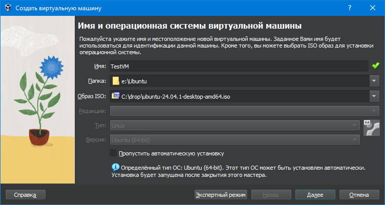
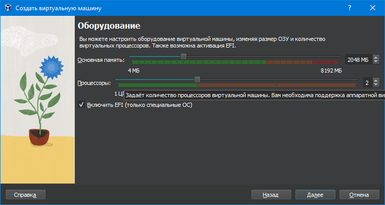
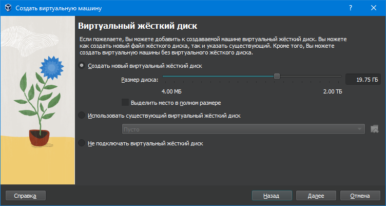
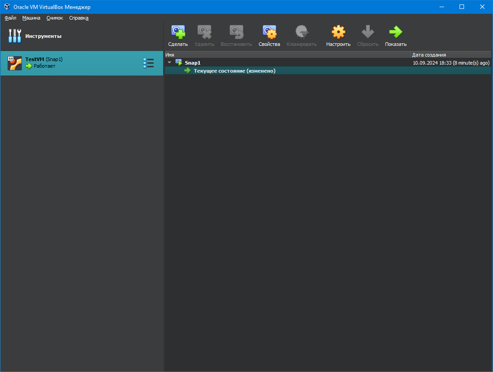
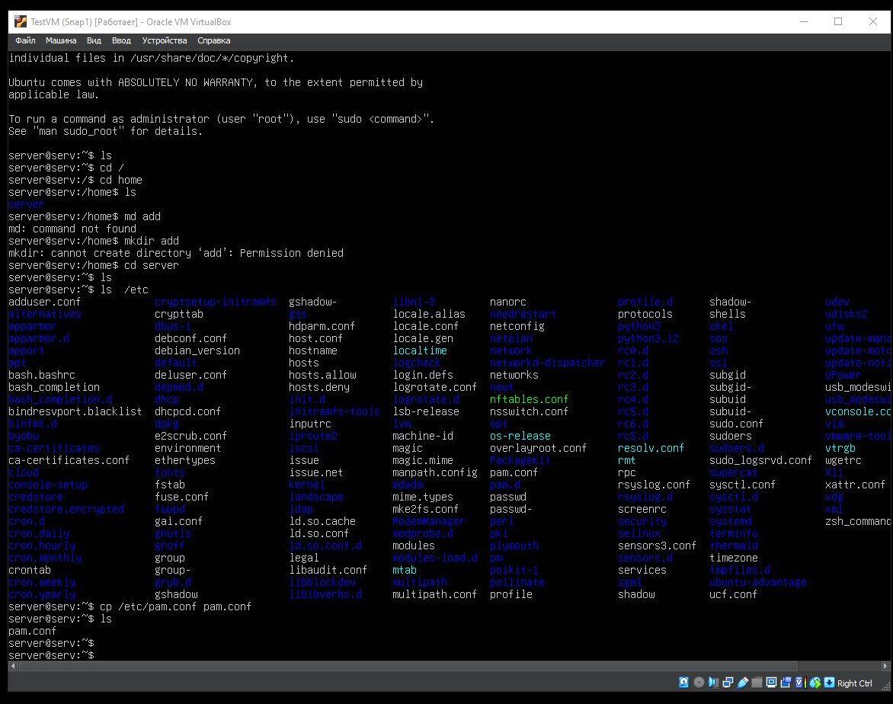
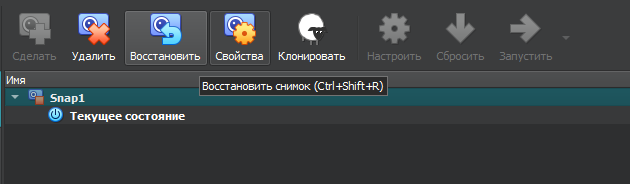
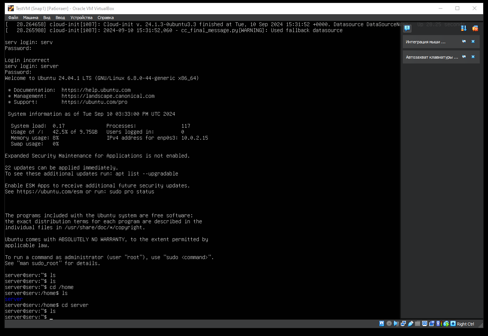
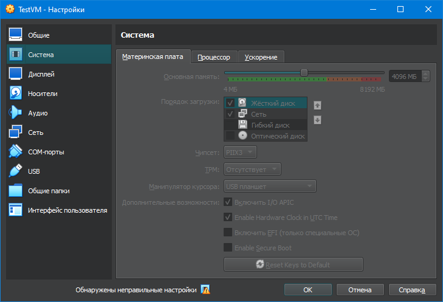
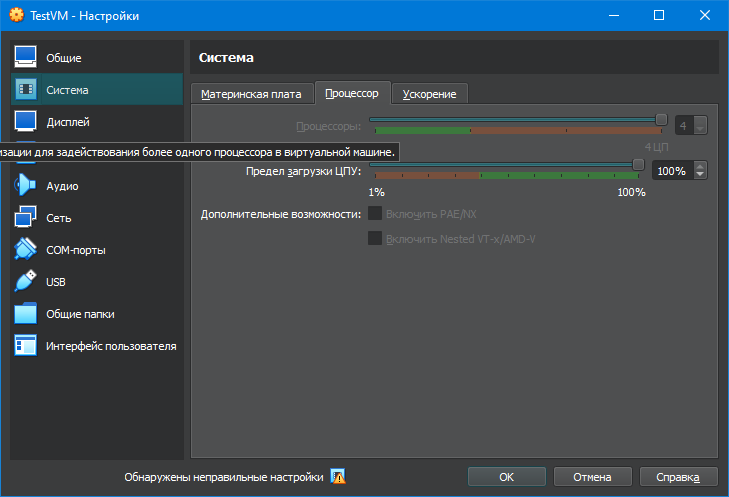
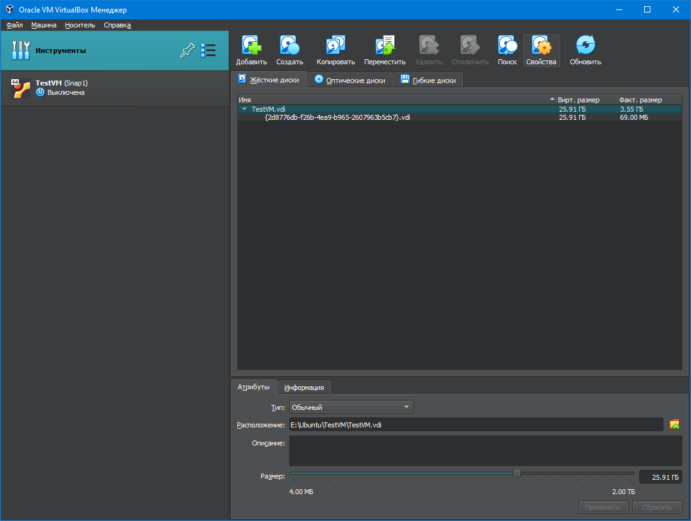

# Краткий отчет:

## 1) Скачал и установил Virtualbox

## 2) скачал образ Ubuntu

## 3) установил Ubuntu со значениями памяти и процессора с задания

## 4) сделал снимок чистой системы

## 5) внес коррекции (скопировал файл /etc/pam.conf в /home/server)

## 6) выключил систему

## 7) восстановил из снимка систему

## 8)запустил систему и проверил, что файла pam.conf нет в /home/server

## 9) выключил систему и увеличил память до 4Гб и ядра CPU до 4-х

## 10) увеличил размер диска до 25Гб через настройки Virtualbox - Инструменты - Жесткий диск - Размер 25.91 Гб

