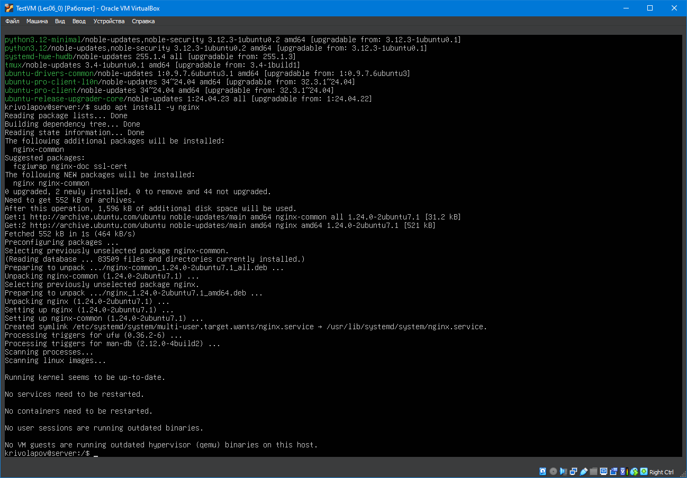
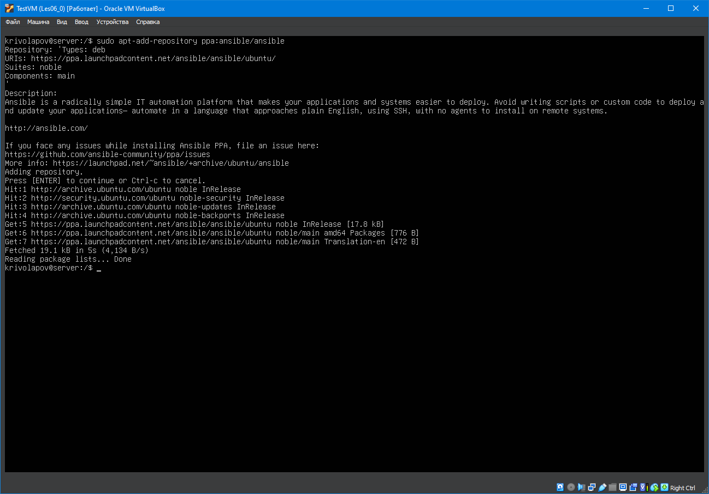
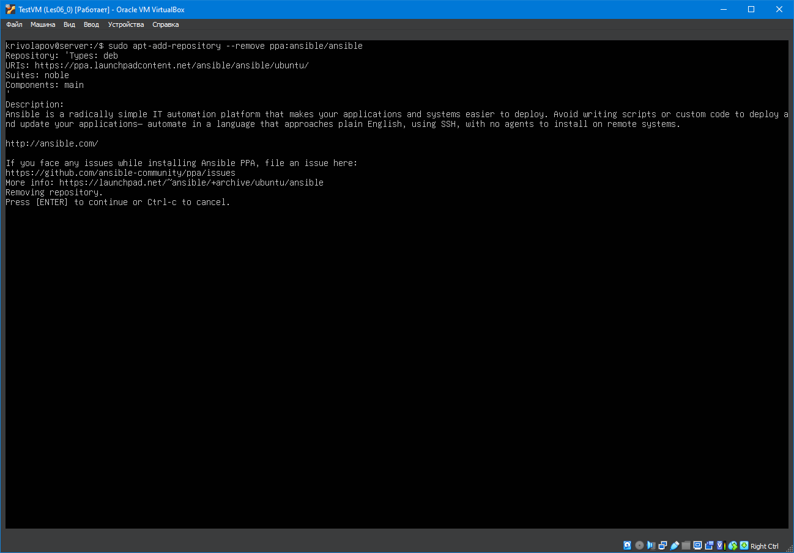
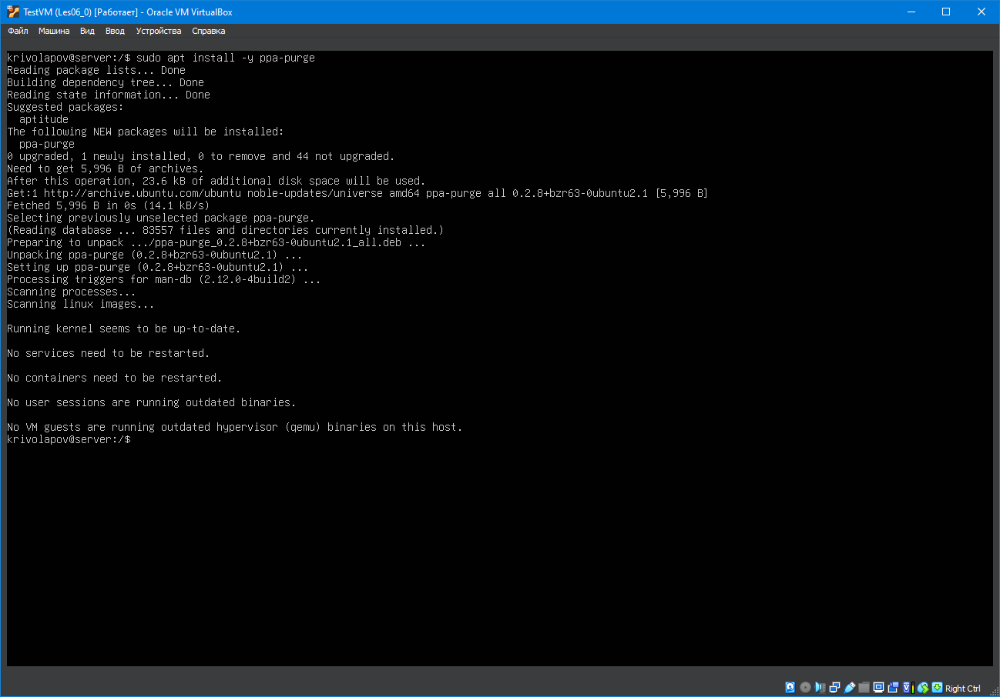
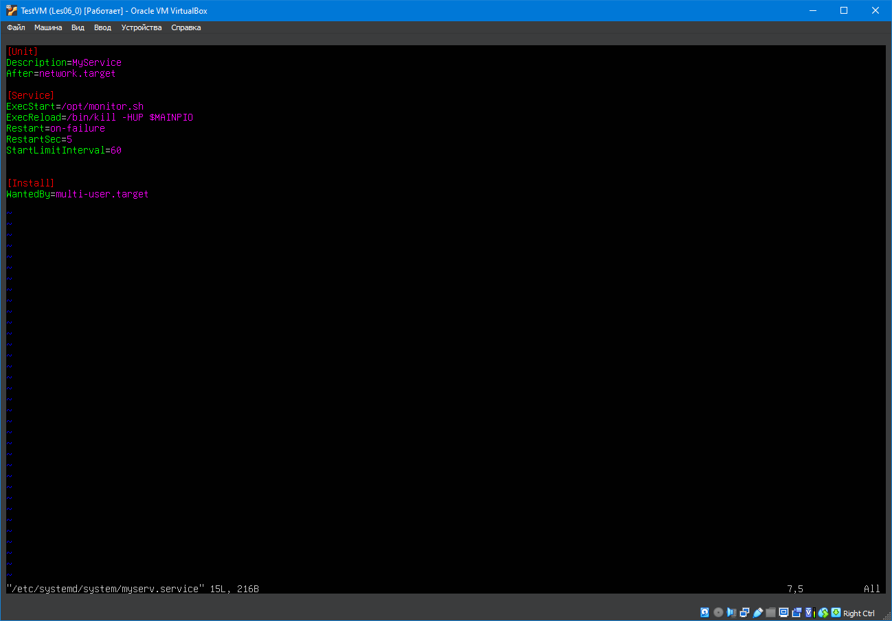
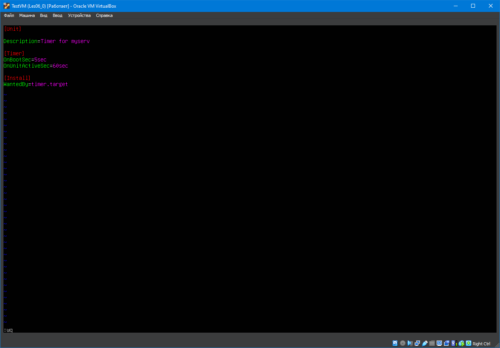
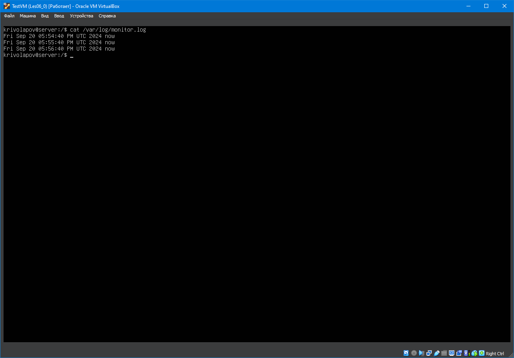
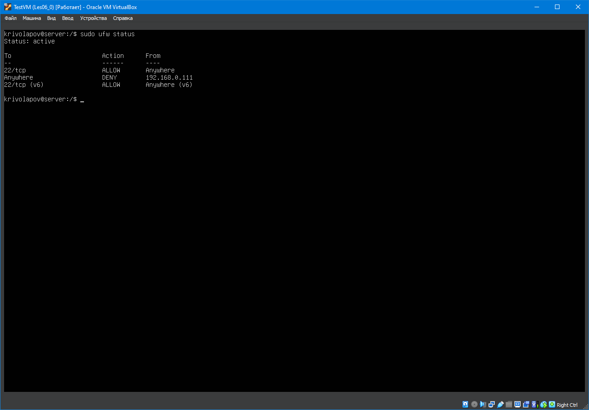

# Advanced Linux

## Домашнє завдання

### 1) Install nginx:
#### sudo apt install -y nginx

### 2) Add repository
#### sudo apt-add-repository ppa:ansible/ansible

### 3) delete repository
#### sudo apt-add-repository --remove ppa:ansible/ansible

#### sudo apt -y install ppa-purge

### File for service myserv

### File for timer myserv

### Log for service myserv

## Firewall configuration
### Allow SSH
#### sudo ufw allow ssh

### Disable All from 192.168.0.111
#### sudo ufw deny from 192.168.0.111

### Firewall status

